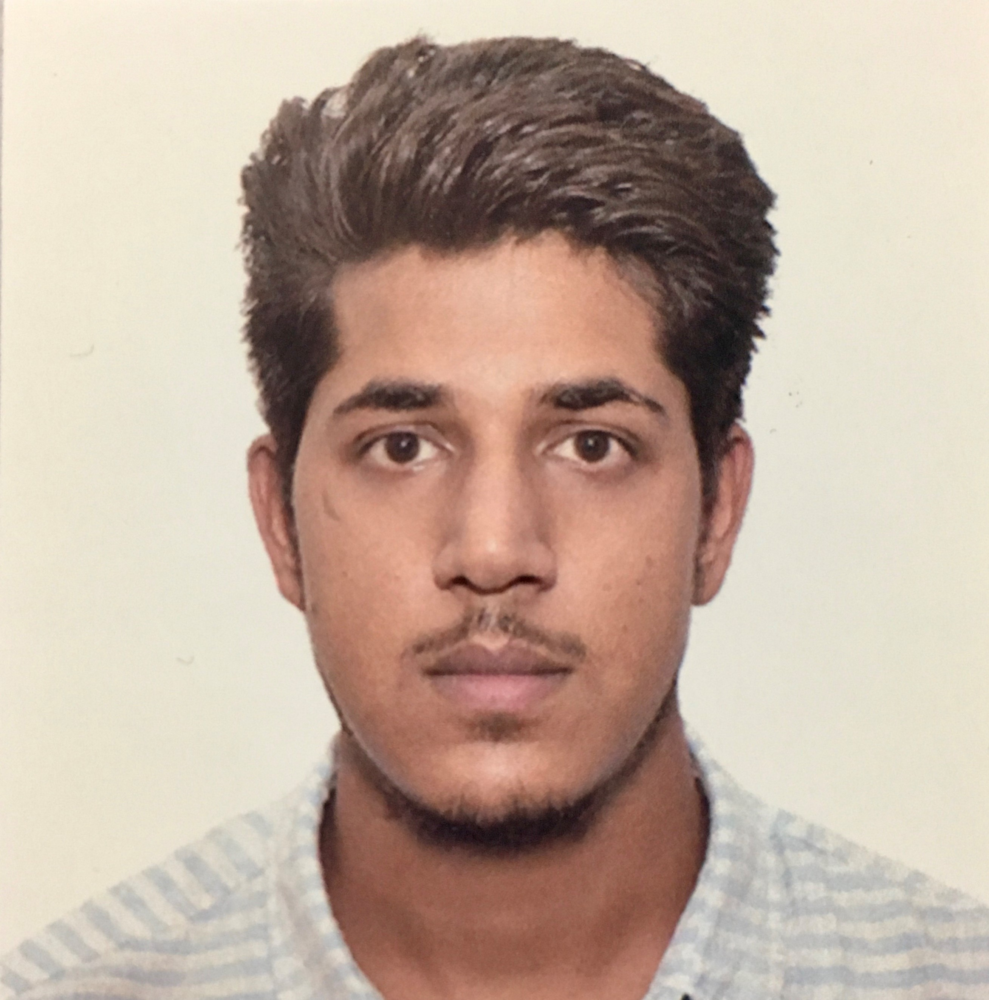

# Info8000_Assignment_1
Your Given Name: Ravi Kumar Meena
Your Preferred Name: Ravi
Your Preferred Pronoun: 
Your Major: PhD in Biological and Agricultural Engineering	
Other Degrees (e.g. Bachelors): Masters in Hydrology 
                                Bechelors in Agricultural Engineering	
                                
List 3 things you hope to get out of the class:

Thing 1 
Thing 2 Want to learn about the Image analysis
Thing 3

Tell me a little about yourself (e.g. hobbies, career aspirations):
I am from India, I just statred my Phd Fall last year. Still trying to learn how the system works. I really like to spend my free time sketching or cooking. As for the career aspiration currently i am just thinking to go for a postdoc after my Phd.

Photo 

